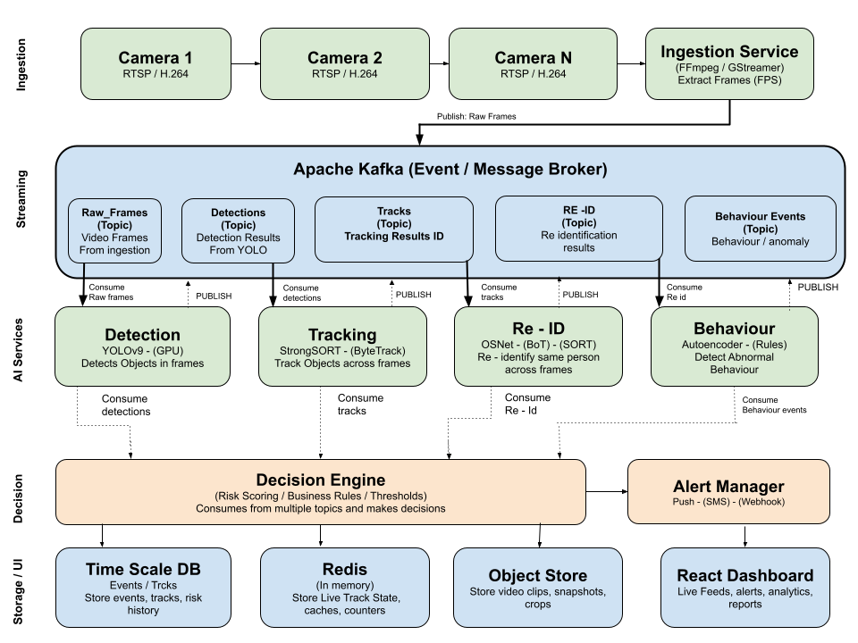

# Virtual Guard

> AI-powered real-time video surveillance platform, multi-camera object detection, cross-camera tracking, person re-identification, and anomaly detection at scale.


---

## Overview

Virtual Guard is a production-grade, edge-first AI surveillance system designed for retail, enterprise, and public safety environments. It ingests live RTSP/H.264 camera streams and processes them through a microservices AI pipeline — detecting, tracking, and re-identifying individuals across multiple cameras in real time.

When anomalous behaviour is detected, the system scores the risk, applies business rules, and dispatches alerts via SMS, webhook, or push notification — all within a target end-to-end latency of under 100ms.

---

## Architecture Overview

```

```

See [docs/architecture.md](docs/architecture.md) for full component diagrams, Kafka topic contracts, and deployment topology.

---

## Key Features

- **Real-time detection** — YOLOv9 GPU inference at 45+ FPS per worker, handling 4–8 camera feeds simultaneously
- **Cross-camera tracking** — ByteTrack + StrongSORT with OSNet embeddings for robust multi-camera person re-identification
- **Anomaly detection** — Three-tier system: LSTM Autoencoder on trajectories, hard rule engine, and supervised classifier
- **Risk scoring** — Configurable weighted risk model with temporal smoothing to minimise false positives
- **Edge-first deployment** — Detection runs on-premises; only metadata and alert clips are sent to cloud
- **Live dashboard** — React frontend with WebSocket-pushed alerts, live feeds, and analytics
- **Alert dispatch** — SMS, webhook, and push notifications with configurable escalation matrix
- **Privacy-by-design** — Embeddings stored, not faces; face blurring on non-flagged clips; GDPR/POPIA erasure endpoints

---

## Tech Stack

| Layer | Technology | Purpose |
|-------|-----------|---------|
| Ingestion | FFmpeg / GStreamer | RTSP stream decoding (NVDEC GPU hardware decode) |
| Event Bus | Apache Kafka | Durable, partitioned, replayable event streaming |
| Detection | YOLOv9 + TensorRT | Object detection at GPU-accelerated inference |
| Tracking | ByteTrack + StrongSORT | Single and multi-camera object tracking |
| Re-ID | OSNet (torchreid) | Person re-identification via 512-d embeddings |
| Anomaly | LSTM Autoencoder | Unsupervised trajectory anomaly scoring |
| Embedding Store | FAISS + Redis | Fast ANN search with TTL-managed live state |
| Time-series DB | TimescaleDB | Event, track, and alert history |
| Object Storage | MinIO / S3 | Video clips, snapshots, person crops |
| Backend | Python + FastAPI | Async microservices |
| Frontend | React + Vite + WebSockets | Live dashboard |
| Orchestration | Kubernetes + Helm | Horizontal GPU worker scaling |
| Observability | Prometheus + Grafana + Loki | Metrics, dashboards, log aggregation |
| CI/CD | GitHub Actions + ArgoCD | GitOps deployment pipeline |

---

## Repository Structure

```
virtual-guard/
│
├── README.md                   ← You are here
├── CHANGELOG.md                ← Version history
├── CONTRIBUTING.md             ← Contribution guidelines
├── LICENSE                     ← MIT License
│
├── docs/
│   ├── architecture.md         ← Full system architecture & diagrams
│   ├── database-design.md      ← TimescaleDB, Redis & object store schemas
│   ├── ai-pipeline.md          ← ML model specs, I/O contracts, GPU requirements
│   ├── api-reference.md        ← REST, WebSocket & webhook API reference
│   ├── decision-engine.md      ← Risk scoring logic, rules & alert routing
│   └── deployment.md           ← Docker, K8s, infra setup & runbook
│
├── services/
│   ├── ingestion/              ← FFmpeg/GStreamer frame extraction service
│   ├── detection/              ← YOLOv9 detection worker
│   ├── tracking/               ← ByteTrack + StrongSORT tracker
│   ├── reid/                   ← OSNet re-identification service
│   ├── behaviour/              ← Autoencoder anomaly detection
│   ├── decision-engine/        ← Risk scoring + alert dispatch
│   └── alert-manager/          ← SMS / webhook / push notification handler
│
├── dashboard/                  ← React frontend
├── infra/                      ← Kubernetes manifests, Helm charts, Terraform
└── scripts/                    ← Dev tools, data utilities, training helpers
```

---

## Documentation

| Document | Description |
|----------|-------------|
| [Architecture](docs/architecture.md) | System design, component diagrams, Kafka topic contracts, data flow |
| [Database Design](docs/database-design.md) | TimescaleDB schema, Redis data structures, object store layout |
| [AI Pipeline](docs/ai-pipeline.md) | YOLOv9, StrongSORT, OSNet, Autoencoder — model specs & I/O contracts |
| [API Reference](docs/api-reference.md) | REST endpoints, WebSocket events, webhook payloads, auth |
| [Decision Engine](docs/decision-engine.md) | Risk scoring, business rules, thresholds, alert escalation |
| [Deployment](docs/deployment.md) | Docker, Kubernetes, GPU setup, monitoring, incident runbook |

---

## Quick Start

> **Prerequisites:** Docker, Docker Compose, NVIDIA GPU with CUDA 11.8+, RTSP-compatible cameras

```bash
# 1. Clone the repository
git clone https://github.com/your-org/virtual-guard.git
cd virtual-guard

# 2. Copy and configure environment
cp .env.example .env
# Edit .env — set RTSP URLs, DB credentials, SMS keys

# 3. Start infrastructure (Kafka, TimescaleDB, Redis, MinIO)
docker compose up -d kafka timescaledb redis minio

# 4. Start AI services
docker compose up -d ingestion detection tracking reid behaviour

# 5. Start decision engine and alert manager
docker compose up -d decision-engine alert-manager

# 6. Start the dashboard
docker compose up -d dashboard

# Dashboard available at: http://localhost:3000
```

See [docs/deployment.md](docs/deployment.md) for full production deployment instructions.

---

## How It Works

**1. Ingestion** — Cameras stream RTSP/H.264 video to the ingestion service. FFmpeg/GStreamer decodes frames using GPU hardware acceleration (NVDEC) and publishes JPEG-compressed frames to the `raw_frames` Kafka topic.

**2. Detection** — The detection worker consumes frames from Kafka and batches them (8 frames per inference call) through YOLOv9 on GPU. Detection results — bounding boxes, class labels, confidence scores — are published to the `detections` topic.

**3. Tracking** — ByteTrack consumes detections and assigns persistent track IDs across frames within a single camera. StrongSORT refines identity assignment using appearance features when needed. Track states are published to the `tracks` topic.

**4. Re-Identification** — OSNet extracts 512-dimensional embeddings for each tracked person. These are matched against the global identity pool stored in FAISS/Redis. Confirmed cross-camera identities are published to the `re_id` topic.

**5. Behaviour Analysis** — An LSTM Autoencoder analyses trajectories (dwell time, movement speed, path entropy). High reconstruction error signals anomalous behaviour. A rule engine layer applies hard business rules on top. Results are published to the `behaviour_events` topic.

**6. Decision Engine** — Consumes all topics. Calculates a weighted risk score per identity. Applies temporal smoothing (score must exceed threshold for ≥30 seconds) before triggering an alert.

**7. Alert & Storage** — Alerts are dispatched via SMS, webhook, or push. Events, tracks, and risk history are persisted to TimescaleDB. Video clips and person crops are stored in MinIO/S3. The React dashboard receives live updates over WebSocket.

---

## Performance Targets

| Metric | Target |
|--------|--------|
| End-to-end alert latency | < 100ms |
| Detection throughput | 45+ FPS @ 640×640 (RTX 3080) |
| Cameras per GPU worker | 4–8 |
| Re-ID match cosine threshold | 0.75 (tunable) |
| Kafka consumer lag | < 15ms |

---

## Roadmap

- [x] Core pipeline design and architecture
- [ ] YOLOv9 detection service implementation
- [ ] ByteTrack + StrongSORT tracking service
- [ ] OSNet re-identification service
- [ ] LSTM Autoencoder behaviour analysis
- [ ] Decision engine and risk scoring
- [ ] Alert manager (SMS, webhook, push)
- [ ] React dashboard with live feeds
- [ ] Kubernetes deployment manifests
- [ ] Cross-store analytics (cloud tier)
- [ ] Predictive risk analytics (6-month data requirement)

---

## Privacy & Legal

Virtual Guard processes biometric data. Before deploying in any real environment:

- Store embeddings, not faces
- Apply face blurring to all non-flagged video clips
- Implement GDPR/POPIA erasure endpoints
- Log all data access and alert acknowledgments
- Encrypt embeddings at rest (classified as biometric data in most jurisdictions)
- Consult legal counsel — biometric surveillance is regulated differently across jurisdictions

---

## Contributing

See [CONTRIBUTING.md](CONTRIBUTING.md) for guidelines.

---

## License

MIT License — see [LICENSE](LICENSE) for details.
